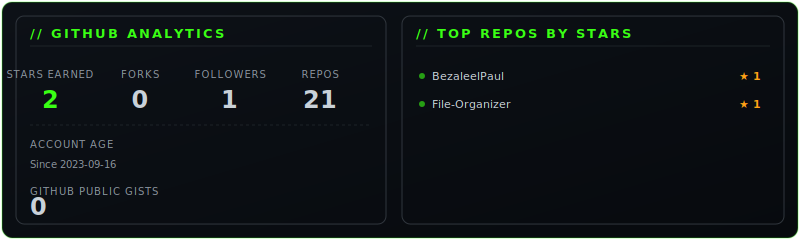
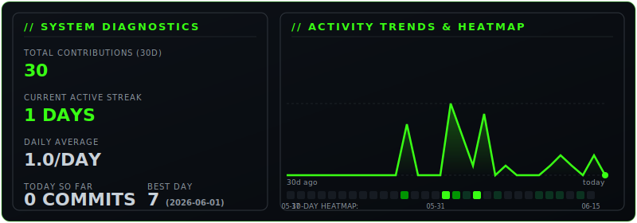
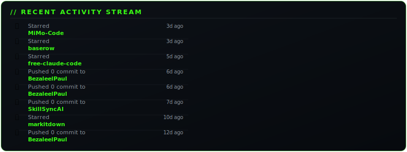

<div align="center">



</div>

```
┌──────────────────────────────────────────────────────────────────────┐
│                                                                      │
│   ██████╗ ███████╗███████╗ █████╗ ██╗     ███████╗███████╗██╗       │
│   ██╔══██╗██╔════╝╚════██║██╔══██╗██║     ██╔════╝██╔════╝██║       │
│   ██████╔╝█████╗      ██╔╝███████║██║     █████╗  █████╗  ██║       │
│   ██╔══██╗██╔══╝     ██╔╝ ██╔══██║██║     ██╔══╝  ██╔══╝  ██║       │
│   ██████╔╝███████╗   ██║  ██║  ██║███████╗███████╗███████╗███████╗  │
│   ╚═════╝ ╚══════╝   ╚═╝  ╚═╝  ╚═╝╚══════╝╚══════╝╚══════╝╚══════╝  │
│                                                                      │
│         [ SYSTEM BOOT COMPLETE ]  [ ALL MODULES ONLINE ]             │
│                                                                      │
└──────────────────────────────────────────────────────────────────────┘
```

<div align="center">


</div>

---

## `$ curl -s "https://github-contributions"`

<div align="center">

### Contribution Activity


<br/><br/>


<br/>

<!-- Trophies removed — github-profile-trophy.vercel.app is permanently down with 402 error -->

</div>

---

## `$ cat ./competitive-programming`

<div align="center">

[](https://codeforces.com/profile/BezaleelPaulN)
[](https://www.codechef.com/users/bezaleelpauln)
[](https://leetcode.com/LavaElixir)
[](https://www.hackerrank.com/bezaleel321)
[](https://www.kaggle.com/bezaleelpaul)

<br/>



<br/>

**LeetCode Performance**


</div>

---

## `$ whoami`

```bash
┌─[bezaleel@forge]─[~]
└──╼ $ cat profile.json
```

```json
{
  "name"        : "Bezaleel Paul N",
  "alias"       : "BezForge",
  "location"    : "Bangalore, India",
  "status"      : "🟢 Online — last pushed to MiMo-Code 7d ago",
  "focus"       : ["AI/ML", "Full-Stack", "Competitive Programming"],
  "personality" : "Builder · Creator · Thinker",
  "mission"     : "I code what motivates me — on the spot. I enjoy the arts,\n                   contemplative thought, and multi-faceted, intellectually\n                   demanding, and imaginatively rigorous projects."
}
```

---

## `$ cat ./github-analytics`

<div align="center">



</div>

---

## `$ ls -la ./tech-stack`

<div align="center">


</div>

---

## `$ ls ./projects --classified`

<details open>
<summary><b>[01] NADICARE Twin Engine</b> ━━━━ ● Active ━━━━ <code>Python · Streamlit · XGBoost</code></summary>
<br/>

> AI-driven digital twin for real-time cardiac performance modeling and stress recovery.

**Key Features:**
- **Digital Twin Modeling** — Real-time simulation of heart rate response to exercise, stress, and recovery
- **Predictive Analytics** — XGBoost algorithms to forecast recovery windows and physiological safety limits
- **Performance Visualization** — Dynamic Plotly dashboards comparing actual vs. predicted cardiac load

[](https://github.com/BezaleelPaul/bnmit-nadicare-health)
</details>

<details open>
<summary><b>[02] File Organizer</b> ━━━━ ● Active ━━━━ <code>Python · Tkinter</code></summary>
<br/>

> Smart GUI tool to automatically sort files by extension and user preferences.

**Key Features:**
- Copy or move files via toggle switch
- Add custom extensions through GUI
- Dark theme with clean modern UX

[](https://github.com/BezaleelPaul/File-Organizer)
</details>

<details open>
<summary><b>[03] BESCOM Calculator</b> ━━━━ ● Active ━━━━ <code>HTML · CSS · JavaScript</code></summary>
<br/>

> Domestic electricity bill calculator with accurate BESCOM tariff slabs.

**Key Features:**
- Accurate monthly bill calculation
- User-friendly interactive UI
- Live hosted on GitHub Pages

[](https://bezaleelpaul.github.io/BESCOM-Calculator/)
[](https://github.com/BezaleelPaul/BESCOM-Calculator)
</details>

<br/>

<details>
<summary><b>📂 More Projects</b></summary>
<br/>

<!-- Hidden projects appear on click — keeping the profile clean but giving depth -->
Projects are continuously being built. Check back often, or visit my [GitHub repositories](https://github.com/BezaleelPaul?tab=repositories) for the full list.

</details>

---

## `$ ./run diagnostics.sh`

<div align="center">



</div>

---

## `$ cat ./recent-activity`

<div align="center">



</div>

---

## `$ ls ./certifications`

<div align="center">

### 📊 Credly Certification Stats

<p align="center">
  
  
</p>

### 🏅 Badge Grid


### 🔄 Auto-Sync History Log

<!-- START_SECTION:badges -->
<!-- END_SECTION:badges -->

</div>

---

## `$ curl -s "https://api.githubstats.com"`

<div align="center">

[](https://github.com/BezaleelPaul)
[](https://github.com/BezaleelPaul)
[](https://github.com/BezaleelPaul)

<br/>

[](https://github.com/BezaleelPaul)
[](https://github.com/BezaleelPaul)

</div>

---

## `$ ping ./connect`

<div align="center">



<br/>

[](https://www.linkedin.com/in/bezaleel-paul-7b114b307)
[](https://www.kaggle.com/bezaleelpaul)
[](https://bezaleelpaul.github.io/)
[](mailto:bezaleel321@gmail.com)

<br/>

[](https://github.com/BezaleelPaul)

<br/>

---

```
┌──────────────────────────────────────────────────────────────┐
│                                                              │
│   "I'm a builder creator who codes what motivates me —      │
│    on the spot. Multi-faceted, intellectually demanding,     │
│    and imaginatively rigorous projects only."                │
│                                                              │
│                           — Bezaleel Paul N                  │
└──────────────────────────────────────────────────────────────┘
```


</div>
